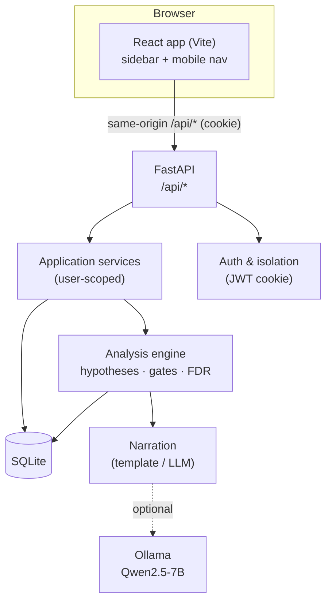
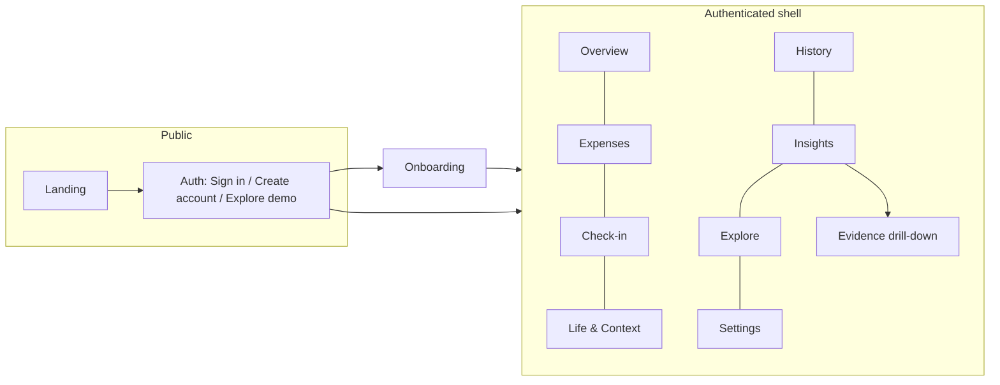
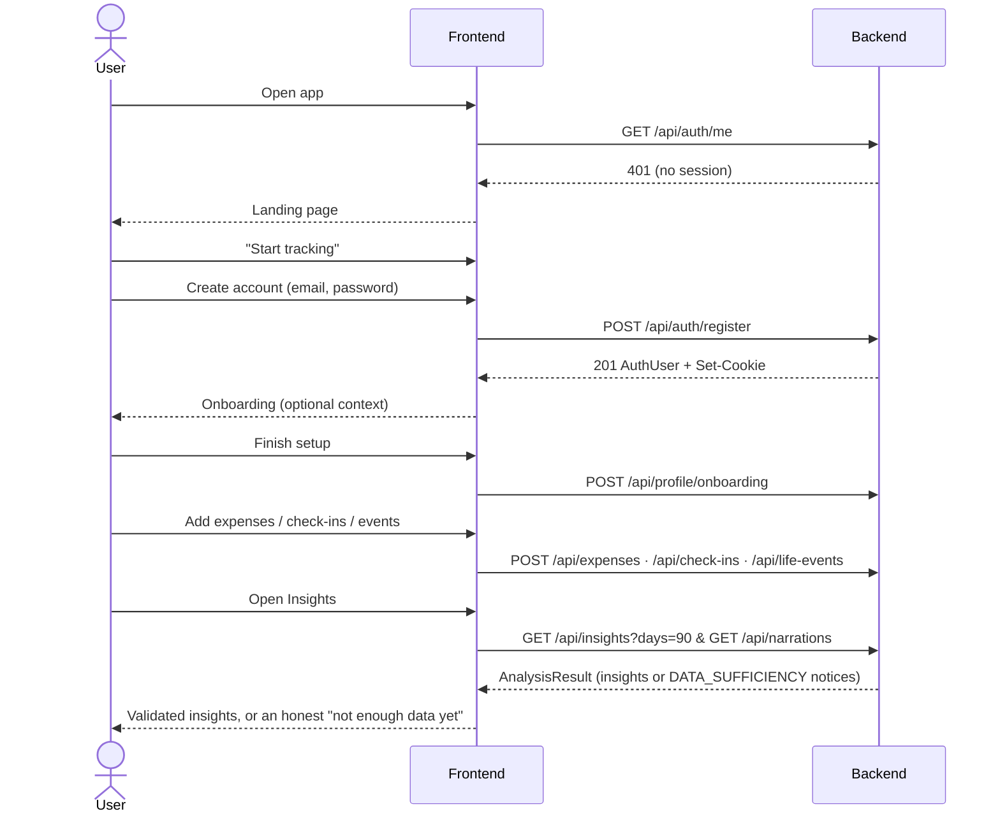
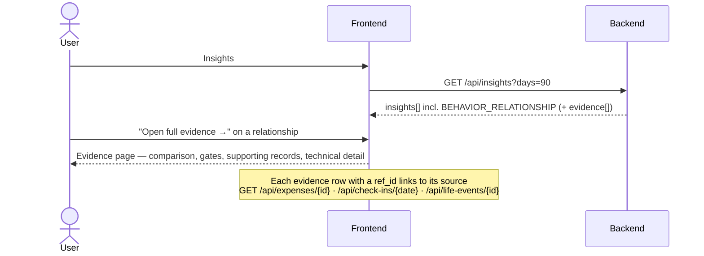
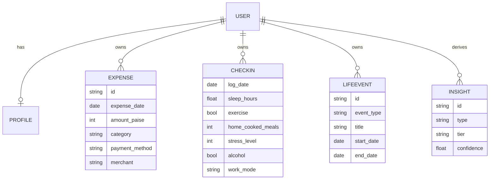

# AI Financial Intelligence — Complete Application & Flows Guide

> A single, self-contained reference for the **running full-stack app**: how to
> start it, every screen and what it outputs, the end-to-end user flows, the
> complete backend API surface with sample responses, the design system, and how
> to test it.
>
> For the product vision and the analysis engine's philosophy, see
> [`README.md`](./README.md). This document is the operational + integration
> companion to it.

---

## Table of Contents

1. [What this is](#1-what-this-is)
2. [Tech stack](#2-tech-stack)
3. [Architecture](#3-architecture)
4. [Run it (verified commands)](#4-run-it-verified-commands)
5. [Configuration & environment](#5-configuration--environment)
6. [Navigation & page map](#6-navigation--page-map)
7. [User flows](#7-user-flows)
8. [Every page: what it shows & what it calls](#8-every-page-what-it-shows--what-it-calls)
9. [Backend API reference (with sample outputs)](#9-backend-api-reference-with-sample-outputs)
10. [Data model](#10-data-model)
11. [The "Organic" design system (frontend re-skin)](#11-the-organic-design-system-frontend-re-skin)
12. [Testing](#12-testing)
13. [Build & deploy](#13-build--deploy)
14. [Troubleshooting](#14-troubleshooting)

---

## 1. What this is

A personal **financial-intelligence** web app. Users record **expenses**, quick
**daily check-ins**, and **life events**; the backend's analysis engine finds
**statistically validated** relationships between habits and spending, and every
insight can be opened to inspect the **evidence** behind it.

The React frontend (`frontend/`) is wired to the FastAPI backend (`backend/`) over
a single origin. Its visual system is the warm **"Organic"** design (terracotta
accent, Caprasimo/Figtree fonts, sidebar + mobile bottom-nav). The `design-frontend/`
folder is the original static **design prototype** and is reference-only — it is
not shipped.

**The loop:** `Record → Build history → Analyse → Insights → Evidence → Understand`.

---

## 2. Tech stack

| Layer | Technology |
|---|---|
| Frontend | React 18, TypeScript, Vite 6, Vitest (jsdom), hand-written SVG charts — no CSS framework, no router (view state in `App.tsx`) |
| Backend | Python 3.13, FastAPI, SQLAlchemy 2.0, Pydantic, SQLite, PyJWT, Argon2id |
| Analysis | Pure-Python stats (Mann–Whitney, Spearman, Kruskal–Wallis) + Benjamini–Hochberg FDR (`q = 0.10`) |
| AI (optional) | Ollama + Qwen2.5-7B for narration; **off by default**, falls back to templates |
| Auth | HttpOnly cookie session (JWT), multi-user, per-user data isolation, separate demo account |
| Deploy | Docker + Docker Compose (backend + Nginx-served frontend + optional Ollama) |

---

## 3. Architecture



- **Single origin in dev:** Vite proxies `/api` → `http://127.0.0.1:8000`, so the
  browser only ever talks to one origin and no CORS config is needed
  (`frontend/vite.config.ts`).
- **AI is downstream of truth:** the engine *establishes* facts; the model only
  *renders* an already-validated insight. If the model is absent, templates are used.

---

## 4. Run it (verified commands)

Two processes: the API on `:8000`, the dev server on `:5173`. These are the exact
commands used to bring the app up in this environment.

### Backend (`:8000`)

```bash
cd backend
pip install -r requirements.txt          # first time only
# demo mode on so you can enter without registering; dev DB in the backend dir
AFI_DEMO_MODE=true AFI_DATABASE_URL="sqlite:///./afi_dev.db" \
  python -m uvicorn app.main:app --host 127.0.0.1 --port 8000
```

Health check:

```bash
curl -s http://127.0.0.1:8000/health
# {"status":"ok","version":"0.1.0"}
```

### Frontend (`:5173`)

```bash
cd frontend
npm install                              # first time only
npm run dev                              # Vite dev server, proxies /api → :8000
```

Open **http://127.0.0.1:5173**. Fastest way in: click **"Explore the demo"**
(requires `AFI_DEMO_MODE=true` on the backend).

> On Windows PowerShell, set env vars inline like:
> `$env:AFI_DEMO_MODE="true"; $env:AFI_DATABASE_URL="sqlite:///./afi_dev.db"; python -m uvicorn app.main:app --host 127.0.0.1 --port 8000`

### One-command stack (Docker)

```bash
docker compose -f docker/docker-compose.yml up --build
```

Starts the backend, the Nginx-served frontend, and (if enabled) Ollama.

---

## 5. Configuration & environment

Copy the example file and adjust:

```bash
cp .env.example .env
```

Key variables:

| Variable | Purpose | Default |
|---|---|---|
| `AFI_DATABASE_URL` | SQLite location | anchored project DB |
| `AFI_DEMO_MODE` | Enables the passwordless demo account + `/api/demo/*` seed/clear | `false` |
| `AFI_AUTH_SECRET` | JWT signing secret. **Required in production** (fail-closed); dev generates an ephemeral one | unset (dev) |
| `AFI_AUTH_COOKIE_NAME` | Session cookie name | `afi_session` |
| `AFI_WEB_PORT` | Published port for the Docker stack | `8080` |
| `VITE_API_TARGET` | Backend target for the Vite proxy | `http://127.0.0.1:8000` |

The AI narration layer is **off by default** — the app is fully functional without it.

---

## 6. Navigation & page map

The signed-in app uses one shell with two responsive layouts.



- **Desktop (> 860px):** fixed 232px **sidebar** — brand, the seven nav links,
  then a footer with the theme toggle, Settings, and Sign out.
- **Mobile (≤ 860px):** a top bar (brand + theme cycle + settings) and a bottom
  tab bar (Overview · Insights · History · Explore) with a centre **"+" FAB** that
  opens an **"Add a record"** sheet (Expense / Check-in / Life & Context).
- **Evidence** is not a nav item — it opens from an insight ("Open full evidence →").
- **Windowed views** (Overview, Insights, Explore) show a control row for the
  analysis window (30 days / 90 days / 6 months) and narration source (Template /
  AI-written).

---

## 7. User flows

### 7.1 First run → first insight



### 7.2 Record an expense

`Expenses` → fill the form (amount in ₹, category, merchant, date, note) →
`POST /api/expenses` (₹ converted to **integer paise** client-side) → the new row
appears in the list and in **History** and the **Overview** window.

### 7.3 Daily check-in (three-state)

`Check-in` → each habit is **Unknown / No / Yes** (or a value). `null` = *unknown /
not logged*, `false`/`0` = *recorded negative*, a value = *recorded*. Saved via
`POST /api/check-ins` (keyed by `log_date`; `PATCH` edits a day, `null` clears a
habit back to unknown).

### 7.4 Insight → Evidence drill-down



The Evidence page reuses `EvidencePanel` and reads `insight.metrics` + `insight.evidence[]`.
**Every insight must carry evidence** — zero evidence is treated as a defect.

### 7.5 Explore (ask your data)

`Explore` → type a question → `POST /api/chat` (single-turn, stateless; the
transcript is a client-side artefact). Answers cite the insights they draw from;
out-of-scope requests (e.g. "where should I invest?") return a **refusal** as a
`200` with `status:"REFUSED"`.

### 7.6 Demo

With `AFI_DEMO_MODE=true`: Auth → **Explore the demo** → `POST /api/auth/demo`
enters a **separate, passwordless, shared** demo account (seeded on first entry).
The shell shows a **Demo** badge and a banner; signing out returns to a real,
empty account.

---

## 8. Every page: what it shows & what it calls

| Page | Output (what the user sees) | Backend calls |
|---|---|---|
| **Landing** | Marketing hero, product-loop cards, principles, module grid, CTAs | none (static) |
| **Auth** | Sign in / Create account tabs, optional "Explore the demo" | `auth/me`, `auth/login`, `auth/register`, `auth/demo`, `demo/status` |
| **Onboarding** | Optional context (life stage, income, work, household, focus, categories, habits) | `profile/onboarding` |
| **Overview** | Window header, spending summary cards + budget, trend/category/period charts, data-health readiness, habits, life-event timeline, top insights | `profile`, `insights`, `narrations`, `narrations/status` |
| **Expenses** | Add-expense form + recent-expenses table | `expenses` (GET/POST/DELETE) |
| **Check-in** | Day form with three-state habit controls + recent check-ins | `check-ins` (GET/POST/PATCH/DELETE) |
| **Life & Context** | Annotate-event form + timeline | `life-events` (GET/POST/DELETE) |
| **History** | One merged, filterable, paginated stream (expenses + check-ins + events) | `expenses`, `check-ins`, `life-events` (GET) |
| **Insights** | Behavioural relationships first (with evidence), event-impact & spending/habit summaries | `insights`, `narrations` |
| **Evidence** | Full-page drill-down for one relationship: comparison, gates, supporting records, technical details | uses the passed insight; `ref_id`s link to record GETs |
| **Explore** | Chat intro + suggestions + composer; cited, evidence-linked answers | `chat`, `chat/capabilities` |
| **Settings** | Profile (name, monthly budget), personalisation, data controls | `profile` (GET/PATCH), `profile/data` (DELETE) |

---

## 9. Backend API reference (with sample outputs)

Base path `/api`. All data routes require the session cookie. Money is **integer
paise**; dates are ISO strings. `GET /health` is the only unprefixed route.

### Auth — `/api/auth`

| Method | Path | Body → Result |
|---|---|---|
| POST | `/register` | `{email,password,display_name?}` → `201 AuthUser` + cookie |
| POST | `/login` | `{email,password}` → `AuthUser` + cookie (401 generic on bad creds) |
| POST | `/logout` | — → `204`, clears cookie |
| GET | `/me` | — → `AuthUser` or `401` |
| POST | `/demo` | — → `AuthUser` (gated by `AFI_DEMO_MODE`) |

```jsonc
// AuthUser
{ "id": "…", "email": "you@example.com", "display_name": "Pranay",
  "is_demo": false, "created_at": "2026-08-16T…" }
```

### Profile — `/api/profile`

| Method | Path | Result |
|---|---|---|
| GET | `/` | `ProfileRead` |
| PATCH | `/` | partial update (display name, `monthly_budget_paise`, personalisation) |
| POST | `/onboarding` | records answers, marks `onboarding_completed` |
| DELETE | `/data` | `204` — wipes expenses/check-ins/events, keeps the account |

### Expenses / Check-ins / Life-events (CRUD)

| Resource | List | Create | Item | Update | Delete |
|---|---|---|---|---|---|
| `/api/expenses` | `GET ?start_date&end_date&category&limit&offset` | `POST` | `GET /{id}` | `PATCH /{id}` | `DELETE /{id}` |
| `/api/check-ins` | `GET ?start_date&end_date` | `POST` | `GET /{log_date}` | `PATCH /{log_date}` | `DELETE /{log_date}` |
| `/api/life-events` | `GET ?start_date&end_date&event_type` | `POST` | `GET /{id}` | `PATCH /{id}` | `DELETE /{id}` |

```jsonc
// POST /api/expenses  → 201 ExpenseRead
{ "id":"exp-1", "expense_date":"2026-07-27", "amount_paise":45000,
  "amount_display":"₹450.00", "currency":"INR", "category":"FOOD_DINING",
  "payment_method":"UPI", "merchant":"Blue Tokai", "notes":null,
  "created_at":"…", "updated_at":"…" }
```

### Insights (the engine) — `/api/insights`

`GET /api/insights?days=90` → `AnalysisResultRead`:

```jsonc
{
  "run": { "engine_version":"…", "window":{"start":"…","end":"…","days":90},
           "gates":{}, "hypotheses_tested":84, "relationships_emitted":1,
           "relationships_suppressed":83, "inputs":{"expenses":…,"check_ins":…,"events":…},
           "currency":"INR" },
  "insights": [
    { "id":"<sha256>", "type":"BEHAVIOR_RELATIONSHIP", "tier":"T3",
      "title_key":"RELATIONSHIP_EXERCISE_FOOD_DINING", "confidence":0.93,
      "window":{…},
      "metrics": { "habit":"exercise", "category":"FOOD_DINING",
                   "group_a":{"label":"…","n":…,"median_paise":…},
                   "group_b":{…}, "difference_paise":…, "relative_difference":0.42,
                   "statistics":{"test":"mann_whitney","p_value":…,"q_value":…,"hypotheses_tested":84},
                   "observations":{"included":…,"excluded_unknown":…},
                   "claim_type":"ASSOCIATION" },
      "evidence": [ { "kind":"AGGREGATE", "label":"group_a", "ref_id":null, "payload":{…} },
                    { "kind":"EXPENSE", "label":"largest_expense", "ref_id":"exp-…", "payload":{…} } ] }
  ],
  "notices": [ /* DATA_SUFFICIENCY insights = the honest "not enough data yet" state */ ]
}
```

- `tier`: `T1` descriptive · `T2` comparative · `T3` correlational (`confidence` only on T3).
- **Evidence** rows: `EXPENSE|CHECK_IN|LIFE_EVENT` carry a real `ref_id` (deep-link
  to the record); `AGGREGATE` is a computed bucket.
- `notices[]` populated with an empty `insights[]` is a **normal** response, not an error.
- Also: `GET /api/insights/types`, `GET /api/insights/{insight_type}`.

### Narrations — `/api/narrations`

| Method | Path | Result |
|---|---|---|
| GET | `/` `?days&generate` | `NarratedAnalysisRead` — each insight explained in prose (template or LLM) |
| GET | `/status` | `LLMStatusRead{provider,model,available,narration_mode}` |
| GET | `/prompt/{insight_id}` | exact prompt + `allowed_numbers` (provenance) |

`generate=false` by default (the local 7B model takes ~18s per insight); template
prose is served immediately and identical in substance.

### Chat — `/api/chat`

`POST /api/chat` `{question, days?, generate}` → `ChatResponse{status, answer,
citations[], refusal_reason?, window, …}`. Single-turn; refusal is a `200` with
`status:"REFUSED"`. `GET /api/chat/capabilities` returns starter examples.

### Demo — `/api/demo`

`GET /status` (always available), `GET /design`, `POST /seed` and `DELETE /` (both
gated by `AFI_DEMO_MODE`).

---

## 10. Data model



**Isolation invariant:** every query is scoped to one `user.id`; no entity is
shared across users; demo data lives in a separate demo account.

**Check-in three-state:** `null` = unknown/not logged · `false`/`0` = recorded
negative · value = recorded. The distinction is the whole point of the schema.

---

## 11. The "Organic" design system (frontend re-skin)

The frontend was re-skinned to the warm **Organic** look while keeping the brand
name **"Financial Intelligence"** and all backend wiring.

- **Tokens** (`frontend/src/index.css`, `:root` + two dark blocks): page `#f5ead8`,
  surface `#ebddc5`, ink `#201e1d`, brand **`--accent` terracotta `#c67139`** (split
  out from the chart palette), radii `16/8/28px`, warm-dark theme.
- **Fonts:** headings **Caprasimo**, body **Figtree** (Google Fonts `@import`).
- **Accessibility preserved:** the CVD-validated `--series-*` chart palette is
  left **unchanged**; only brand/surface/status tokens were re-anchored.
- **Shell** (`frontend/src/App.tsx`): desktop sidebar; mobile top bar + bottom
  tabs + FAB add-sheet (rendered by a guarded `matchMedia` hook at 860px).
- **New pages:** `Landing`, `History`, `Evidence`; **Explore** = the existing Chat
  page; anon flow is Landing → Auth (`Auth` gained `initialMode`/`onBack`).

The original prototype lives in `design-frontend/` and is **reference-only**.

---

## 12. Testing

```bash
# Frontend (Vitest + jsdom): renders App and every page against a stubbed fetch
cd frontend && npm run typecheck && npm test && npm run build

# Backend (pytest): auth, isolation, migrations, analysis, FDR, gates, safety, demo
cd backend && pytest
```

Current frontend status: **typecheck clean · 159/159 tests pass · production build
succeeds**. The suite covers auth/isolation, the shell & navigation, all data
pages, the analysis presentation, the chat, and the new Landing / History /
Evidence pages. The backend keeps a synthetic dataset with **planted patterns**
the engine should find and **negative controls** it should ignore.

---

## 13. Build & deploy

```bash
# Frontend production bundle
cd frontend && npm run build      # → frontend/dist (static, served by Nginx in Docker)

# Full stack
docker compose -f docker/docker-compose.yml up --build
```

In production, set `AFI_AUTH_SECRET` (the app fails closed without it) and serve
frontend + API behind the same reverse proxy so the session cookie stays first-party.

---

## 14. Troubleshooting

| Symptom | Cause / fix |
|---|---|
| App shows Landing, "Explore the demo" missing | `AFI_DEMO_MODE` not `true` on the backend |
| `/api/*` calls 404 / network error in dev | Backend not on `:8000`, or `VITE_API_TARGET` mismatch |
| Insights empty but no error | Not enough history yet — `notices[]` carries `DATA_SUFFICIENCY`; this is expected |
| Narration says "unavailable" | No local model configured — templates are used; set up Ollama to enable AI-written prose |
| Fonts flash on first load | Google Fonts loading; settles immediately |
| Production refuses to start | `AFI_AUTH_SECRET` must be set (fail-closed) |

---

> **Record. Analyse. Verify. Understand.** — the app never claims more than the
> user's own recorded history supports.
